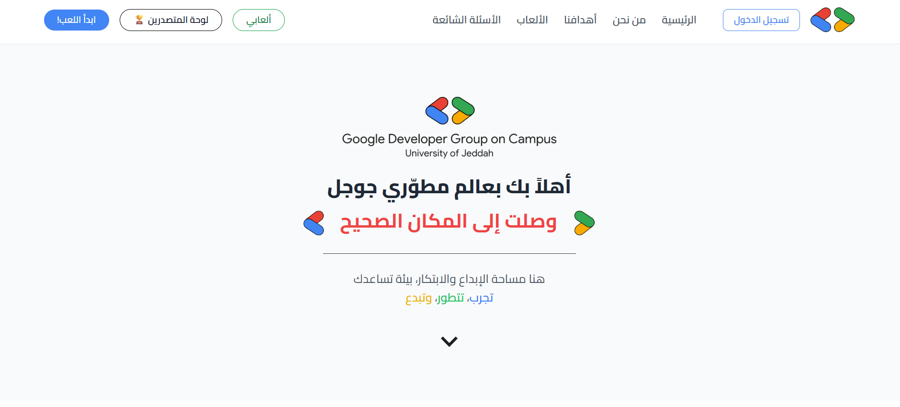

# GDG Gaming Platform

### Interactive Event & Workshop Gaming System

 

## Overview

The GDG Gaming Platform is a unified web-based gaming system developed for Google Developer Groups (GDG) workshops and community events.

The platform enhances attendee engagement through interactive digital games while providing organizers with tools to manage content and gameplay.

---

## Visual Overview

---

## Features

- Image guessing games
- Family Feud-style challenges
- Word puzzle games
- AI-generated Arabic Computer Science quizzes
- Gemini API integration
- Admin dashboard for content management
- Real-time game logic and countdown timers
- Secure authentication using JWT

---

## Tech Stack

### Frontend

  
  
  
  

### Backend

  
  

### Database & APIs

  
  
  

---

## Impact

The platform increases engagement during technical events and workshops by transforming educational content into interactive game experiences powered by AI.
